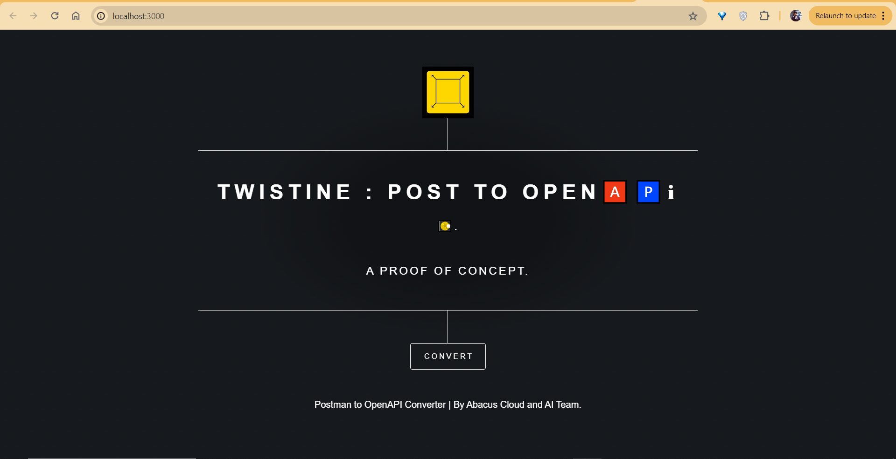

# Postman to OpenAPI converter

A utility to convert Postman <a href='https://www.postman.com/collection/' target='_blank'>collections</a> to <a href='https://www.openapis.org/' target='_blank'>Open API</a> schema in one click.
All the conversion happens on the browser itself hence the collection data is completely secure and no data is exchanged after page is loaded.

## ✨ Demo

### Installation
1. Clone this repo: `git clone https://github.com/SaroashDS/openapi-twisterv1.git`
2. Use supported node version by `nvm use`
3. Navigate to the directory and run `npm install`
4. Run `npm run dev`
5. Make your changes

#### Convert collection JSON file to OpenAPI schema

# Acknowledgements
[Frontent inspiration](https://github.com/DefCon-007/postman-to-openapi-online.git)